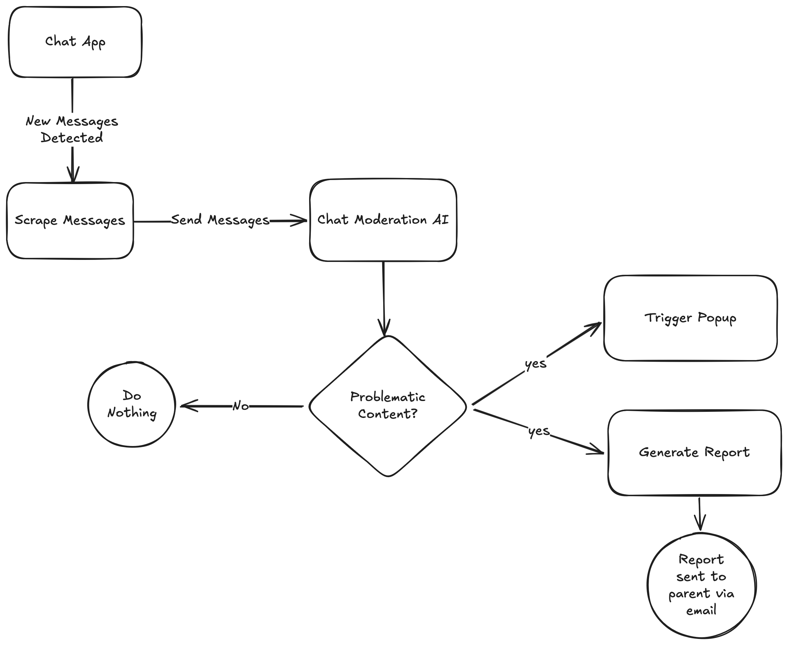

# HCI Project



## Instructions to Activate Extension
1. Download the repository to local
2. Go to chrome://extensions/.
3. At the top right, turn on Developer mode.
4. Click Load unpacked.
5. Find and select the extension folder.

This should activate the extension.

## Instructions to Activate Server
1. Install uv.
```bash
curl -LsSf https://astral.sh/uv/install.sh | sh
```
2. In the working directory, set up the dependencies.
```bash
uv sync
source .venv/bin/activate
```
3. Create a file `.env`.
```bash
OPENAI_API_KEY="<your-api-key>"
GOOGLE_APP_PASSWORD="<your-google-app-password>"
```
4. Run the server.
```bash
fastapi dev main.py
```

